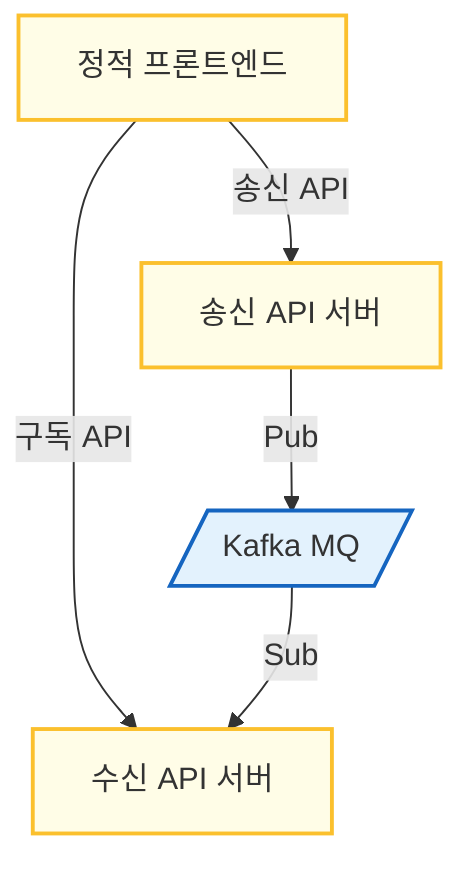
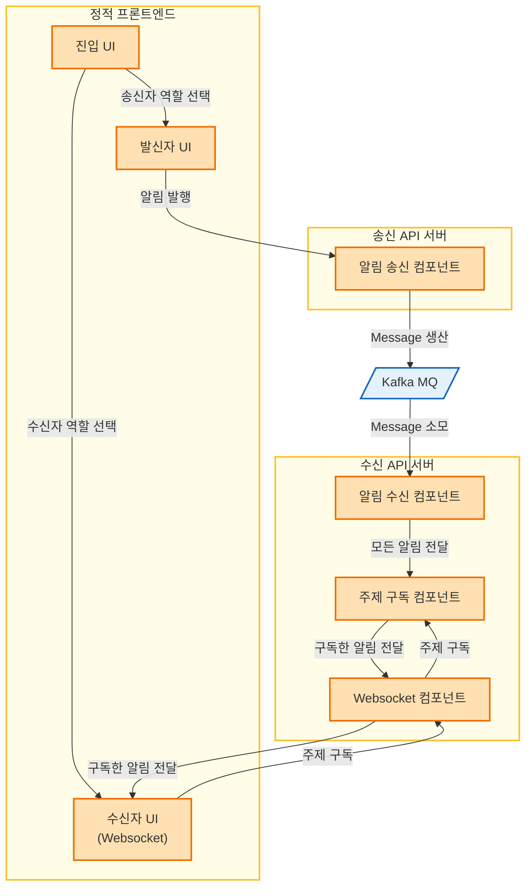

# SimpleWebsocketMQ

이 프로젝트는 간단한 Toy 프로젝트이며, WebSocket을 지원하는 백엔드를 통해 여러 사용자들이 간단한 알림 발행 및 수신을 할 수 있도록 지원한다.

## 1. 프로젝트의 소개

### 1.1. 목적

이 프로젝트를 통해 Apache Kafka 및 Grafana 사용법을 학습해 본다.

### 1.2. 의사결정 기준

이 프로젝트는 Toy 프로젝트이므로 간단한 구현을 최우선으로 고려한다.

### 1.3. 용어

| 용어                      | 뜻                                                                            |
| ------------------------- | ----------------------------------------------------------------------------- |
| 발신자(Sender)            | 알림을 보내는 웹 클라이언트                                                   |
| 수신자(Receiver)          | 알림을 받는 웹 클라이언트                                                     |
| 웹 클라이언트(Web Client) | 웹 인터페이스를 통해 접속한 사람                                              |
| 알림(Notification)        | 발신자가 수신자에게 보내는 정보. 제목과 내용으로 구성됨.                      |
| 주제(Topic)               | 알림의 주제. 한 알림은 여러 주제를 가질 수 있음. 수신자는 특정 주제를 구독함. |
| 구독(Subscribe)           | 수신자가 특정 주제에 해당되는 모든 알림을 받겠다는 의사표시                   |


## 2. 프로젝트의 요구사항 정의

### 2.1. 외부 객체 정의

- 웹 클라이언트
  - 알림을 송수신할 잠재력이 있는 웹 클라이언트. 프론트엔드 UI를 통해 상호작용한다.
  - 발신자와 수신자로 나뉜다.
- 발신자
  - 웹 클라이언트 중 알림을 보내는 자.
- 수신자
  - 웹 클라이언트 중 알림을 받는 자.

### 2.2. 요구사항 정의

- **기능적 요구사항**
  - **역할 선택 기능**
    - 웹 클라이언트는 발신자와 수신자 중 무엇이 될지 선택할 수 있어야 한다.
    - 역할 변경은 *지원하지 않는다.*
  - **알림 송신 기능**
    - 발신자는 알림을 보낼 수 있다.
      - 알림은 제목과 내용으로 구성된다.
        - 제목과 내용은 적당히 짧은 문자열이다.
      - 알림은 하나 이상의 주제를 가져야 한다.
        - 주제는 적당히 짧은 문자열이다.
        - 주제의 생성은 제한이 없으며 구독자가 없는 주제도 알림을 발행할 수 있다.
  - **주제 구독 기능**
    - 수신자는 하나 이상의 주제를 구독할 수 있다.
    - 수신자는 하나 이상의 주제를 구독 취소할 수 있다.
      - 사용자가 구독할 수 있는 주제의 갯수에는 한계가 있다.
  - **알림 수신 기능**
    - 수신자는 구독한 주제를 가진 알림이 발신되면 이를 수신하여야 한다.
      - 수신자는 구독 이후에 발생한 알림을 수신함을 보장받는다.
      - 수신자는 구독 이전에 발생한 알림을 수신하지 않음을 보장받는다.
- **비기능적 요구사항**
  - 로그를 기록한다.
  - 시스템 사용률 등을 모니터링한다.
  - 주요 기능을 문서화한다.
  - 테스트를 실시한다.
  - 일관된 배포를 위해 컨테이너화한다.
  - 인증/인가는 *지원하지 않는다.*
  - 전송 데이터의 기밀성, 무결성, 가용성도 *보장하지 않는다.*
    - 이유: 구현 자체에 집중하기 위해서
    - 고의적으로 이를 배제하는 것이 아니라, 최우선 고려대상이 아니라는 뜻이다.

## 3. 프로젝트의 기능 정의

### 배포 관점 정의



### 흐름 관점 정의



### 인터페이스 관점 정의

#### 송신 API 서버

| 엔드포인트 | 메서드 | 설명        |
| ---------- | ------ | ----------- |
| `/send`    | POST   | 알림을 발행 |

- `/send`
  - Request
    - Body는 다음과 같다.
```json
{
  "title": "example title here",
  "contents": "example contents here",
  "topics": [
    "example-topic-1",
    "example-topic-2"
  ]
}
```
  - Response
    - `200 OK`: 성공
      - 성공했을 때, 서버가 해당 메시지를 발행한 `timestamp` 값을 Response body로 반환
      - 예시: `1750144428`
    - `400 BAD REQUEST`: 잘못된 데이터 형식
    - `503 SERVICE UNAVAILABLE`: 서버 Busy

#### 수신 API 서버

| 엔드포인트 | 메서드       | 설명             |
| ---------- | ------------ | ---------------- |
| `/connect` | GET(UPGRADE) | 수신 서버에 연결 |

- `/connect`
  - Request
    - todo: websocket의 처리 방식에 대해 공부...
  - Response
    - `101 SWITCHING PROTOCOL`: Websocket 수립
    - `503 SERVICE UNAVAILABLE`: 서버 Busy

#### Websocket STOMP (수신자UI ~ 수신API서버)

- 주제 구독 (수신자 -> 수신API서버)
  - Websocket 프레임: `SUBSCRIBE destination:/topic/{example-topic}`
- 주제 구독취소 (수신자 -> 수신API서버)
  - Websocket 프레임: `UNSUBSCRIBE /topic/{example-topic}`
- 알림 수신 (수신API서버 -> 수신자)
  - 브로드캐스트 타깃: `/topic/{example-topic}`
  - Websocket 프레임: `Notification` 클래스의 JSON Serialization

#### Kafka Message (송신API서버 ~ Kafka ~ 수신API서버)

- `Notification` 클래스의 Serialization을 메시지로 사용
  - Spring Boot의 Serial/Deserialization 지원 사용

### 클래스 관점 정의

- 도메인
  - `Notification` (엔티티)
    - title: `NotificationTitle`
    - contents: `NotificationContents`
    - topicList: `NotificationTopicList`
    - issuedAt: `NotificationTimestamp`
  - `NotificationTitle` (값)
    - value: string
  - `NotificationContents` (값)
    - value: string
  - `NotificationTopicList` (값)
    - value: `TopicList`
  - `NotificationTimestamp` (값)
    - value: `java.util.Date`
  - `TopicList` (값)
    - topics: `List[Topic]`
  - `TopicListBuilder` (빌더)
      - .buildFrom: `(TopicList) => TopicListBuilder`
      - .addTopic: `(Topic) => TopicListBuilder`
      - .removeTopic: `(Topic) => TopicListBuilder`
      - .build: `() => TopicList`
  - `Topic` (값)
    - value: string
  - `Receiver` (엔티티)
    - sessionId: string (= WebSocketSession)
    - subscribedTopics: `TopicList`
    - .sendNotification: `(Notification) => bool`
      - Websocket 통해 실제로 메시지 전달하는 로직
  - `MessageBrokerService` (도메인 서비스)
    - .subscribe: `(Receiver, Topic) => bool`
    - .unsubscribe: `(Receiver, Topic) => void`
    - .unsubscribeAll: `(Receiver) => void`
    - .notify: `(Notification) => void`
- 공용 애플리케이션 컴포넌트
  - `NotificationDTO`
    - .from: `staticmethod (Notification) => NotificationDTO`
    - .make: `() => Notification`
- 애플리케이션 서비스 (Controller-Service-Domain-Repository, 도메인 레이어는 상단에 기술)
  - 송신 API 서버
    - 컨트롤러
      - `NotificationSendController`
    - 앱 서비스
      - `NotificationSendServiceDefault` (impl `NotificationSendService`)
    - 리포지토리
      - `MessagePublishRepositoryKafka` (impl `MessagePublishRepository`)
  - 수신 API 서버
    - 컨트롤러
      - `WebsocketConnectController`
      - `SubscribeController`
      - `UnsubscribeController`
      - `WebsocketDisconnectController`
    - 앱 서비스
      - `NewReceiverServiceDefault` (impl `NewReceiverService`)
      - `SubscribeServiceDefault` (impl `SubscribeService`)
      - `UnsubscribeServiceDefault` (impl `UnsubscribeService`)
      - `KillReceiverServiceDefault` (impl `KillReceiverService`)
    - 리포지토리
      - `ReceiverRepositoryInMemory` (impl `ReceiverRepository`)
        - .create: `(Receiver) => bool`
        - .find: `(sessionId) => Receiver`
        - .update: `(sessionId, Receiver) => bool`
        - .delete: `(sessionId) => bool`
      - `MessageReceiveRepositoryKafka` (impl `MessageReceiveRepository`)
        - .receive: `(Notification) => void`

## 4. 참고자료

- [Websocket](https://developer.mozilla.org/ko/docs/Web/API/WebSocket)
  - 폴링 vs 웹소켓
    - 폴링: 비연결형, 클라이언트가 서버에게 지속적으로 쿼리
      - 서버가 클라이언트한테 HTTP 요청을 보내는 것은 매우 부자연스러움
    - 웹소켓:: 연결형, 서버가 클라이언트에 직접 전송 가능
- [STOMP 프로토콜](https://stomp.github.io/stomp-specification-1.2.html)
  - Websocket 위에서 동작
  - 단순 데이터(이진, 텍스트) 전송 위에 Pub/Sub 패턴 추상화를 제공
- [Apache Kafka](https://kafka.apache.org/)
  - 메시지 큐로 활용
  - 이를 통해 알림 송신 서버와 알림 수신 서버를 별도로 관리 및 배포 가능함